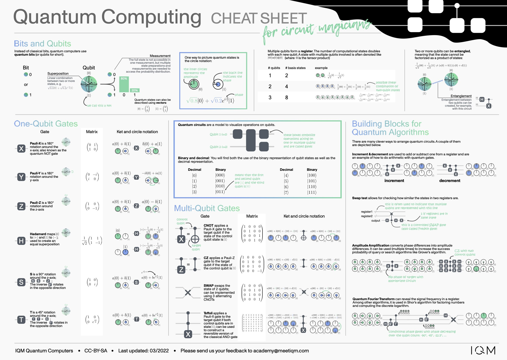

# IQMs Quantum Computing Cheat Sheets

This repository contains a collection of cheat sheets.
The cheat sheets were created by [Stefan Seegerer](https://github.com/manzanillo) using Affinity Designer (.afdesign file).

## Cheat Sheets

### Quantum Computing Cheat Sheet for Circuit Magicians

## Folder Structure

Each cheat sheet has its own folder. Inside this folder there are different subdirectories for languages. However, at the moment only one cheat sheet is published. Stay tuned for more :-)

## Contribute

If you found a mistake or want to contribute a translation, please create an issue or a pull request. If you have a wish for another cheat sheet, please also create an issue for that.

## Licence

The cheat sheets are licenced under [CC-BY-SA](https://creativecommons.org/licenses/by-sa/3.0/de/deed.en) licence. So you are free to remix and share the content you created if you give attribution to the author (IQM Quantum Computers) and distribute your contributions under the same license as the original. However, IQMs logo does not fall under this licence. In case you use it somewhere else, please remove IQMs logo.
